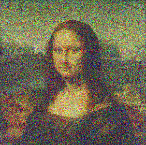
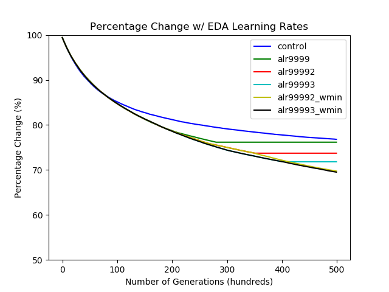

# Image-Recreation-w-Genetic-Algorithm

&nbsp;&nbsp;&nbsp;&nbsp;&nbsp;&nbsp;This was the final project for my 2S03 - Programming in C Course. This project required us to create a **Genetic Algorithm** for the recreation of a given image starting from a randomly generated PPM image. To further improve the efficacy of this algorithm, we applied an **Exponentially Decaying Adaptive Learning Rate** to the Genetic Algorithm in order to further improve the accuracy of the model given the same original input parameters.
  
&nbsp;&nbsp;&nbsp;&nbsp;&nbsp;&nbsp;For a better visualization of the algorithm refer to my personal website with the full video attached (http://akilhamilton.com) in the Evolutionary Image Modal.  

## Mona Lisa Recreation
Depicted below is the recreation of the Famous Painting "Mona Lisa" by the Algorithm.

### Original & Recreated Image

### Gif of Image Recreation

## Application of Adaptive Learning Rate on Training Accuracy
Graph depicting the efficacy of various adaptive learning rates on a given input image.

## Credits
Credit to Irfan View for visualizing PPM images. (https://www.irfanview.com/)
